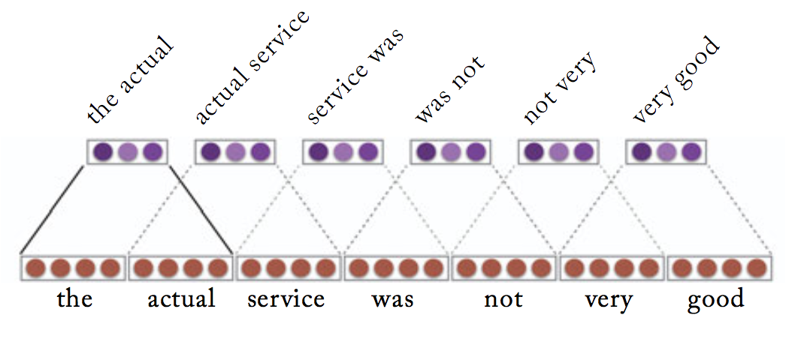
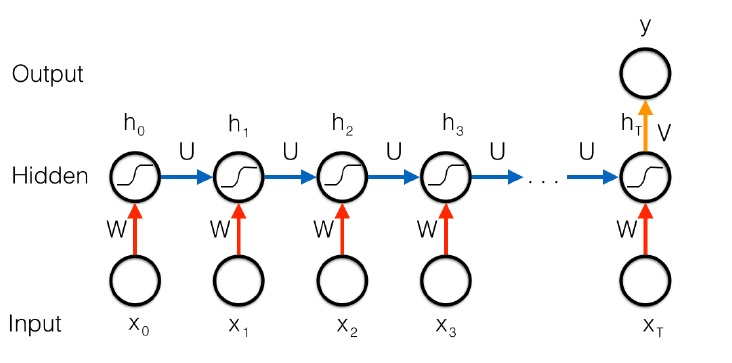

```{r setup, include=FALSE}
knitr::opts_chunk$set(echo = FALSE)
```

# Introduction

In this poster, we demonstrate a practice of industry classifications with job descriptions. In the dataset of the DataFest 2018, around 90% of the job postings do not have industry information. Using the words in the job description, we try to classify the job postings without industry information to different industries. 

## Objectives

Build model to perform job industry classification

# Methods

1.Seperate the job postings with industry information into training and testing sets.
2.Extra and split every word in the industry and title column with NAs removed
3.Based on the word list, create an industry and title word dictionary
4.


# Results

* The model was able to achieve a 50% acuracy in prediction industries categories.

* The random guess will produce a accuracy of only 4%

* The model is able to improve the results from random guess by over 10 times


# Next Steps

In this section we propose two methods that would significantly improve the accuracy. Unfortunately, the hardware limitation prevented us from using those models.

## Text Convolutional Neural Network

* Learning the filter $\mathcal{F}$ that the convolution result $\mathcal{F}*\mathcal{T}$ would grasp the "key information" in the sentence

* Perserve the contexual (or spacial) information of the "key information" in the sentence

* Pass the convolution result to traditional classifiers such as softmax or SVM would generate prediction

```{r echo=FALSE, out.width='100%'}

```

## Recurrent Neural Network (LSTM)

* Learn how to extract information not only from words themselves but also from the context.

* Is able to combine all information in the sentence before making decision

* Pass the output from the RNN to traditional classifier would generate prediction

```{r echo=FALSE, out.width='100%'}

```

# Conclusion


```{r, include=FALSE}
knitr::write_bib(c('knitr','rmarkdown','posterdown','pagedown'), 'packages.bib')
```

# References
