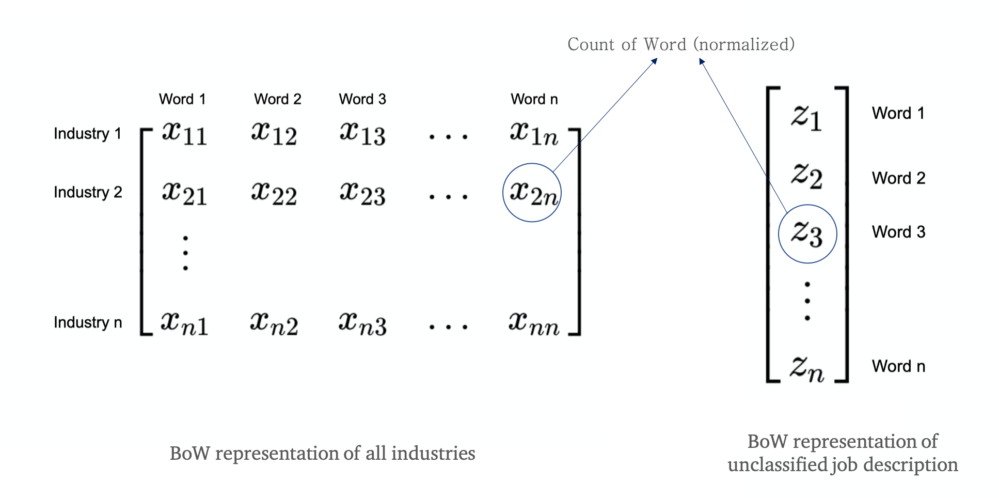
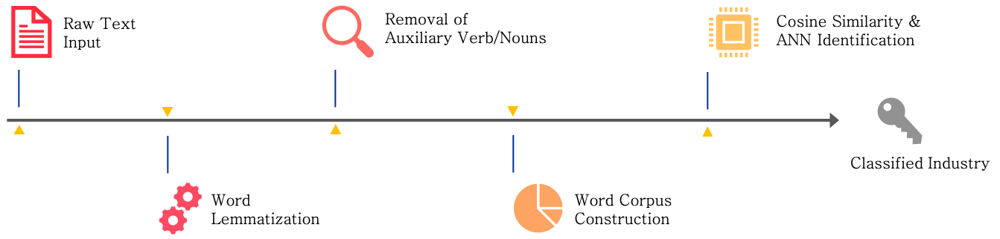

```{r setup, include=FALSE}
knitr::opts_chunk$set(echo = FALSE)
```

# Introduction

In this poster, we demonstrate a practice of industry classifications of job openings according to analysis of their descriptions. Among the 14.5 million job records in the Indeed dataset, over 13 million(90%) of them do not have specifications of the industries that the companies belong to. Obviously, most job posters are reluctant to contribute the information, while in reality, job seekers consider the company's industry an important factor since it determines their future work environment, learning opportunities and career development. Therefore, our team decided to recover this useful information by classifying the job postings into specific industries with machine learning methods. We believe such endeavor allows Indeed to provide more accurate and useful information for users and therefore greatly improves its user experience.

## Objectives

Build model to perform job industry classification

# Methods

## Prepare Data

* Down sample to data size to 200000 for performance consideration

* Extract the rows without "industry" being NA to be our data set (gives about 10000 rows)

* Separate this dataset with industry information into training and testing sets

## Cleaning of Dataset

* There could be polymorphism of words such as "engineers" and "teachers", which should be changed back to their original format such as "engineer" and "teacher"

* The auxiliary verbs/noun that does not matter too much for the classifier, but complete sentences does use a lot of them. Thus, we decided to remove them

* Use pretrained natural language models in python library to achieve this

## Build Corpus 

* Due to limitation in our hardware, we decied to use Bag-of-Word descriptor for each industry cluster [@WEBSITE:2]

* We construct the same representation of any new job description that is not classified

```{r echo=FALSE, out.width='80%', fig.align='center'}

```

## Modeling

* Cosine similarity between the representation of the job description and each each industries are calculated

$$ \text{similarity}\left(\overrightarrow{V},\overrightarrow{U}\right)=\frac{\overrightarrow{V}\cdot \overrightarrow{U}}{||\overrightarrow{V}|| \cdot||\overrightarrow{U}||} $$

* Train a ANN model to further process this similarity vector in order to count discrepancies in the count of each industry in the model

* Test shows that adding this prior belief increase the performance significantly.

## Summary of Pipeline
```{r echo=FALSE, out.width='100%', fig.align='center'}

```

# Results & Conclusion

* Through analyzing the job description text with our model, we successfully classify 47 % of the industry information. In comparison to random guess accuracy of 4%, our model is able to perform > 10 times better

* Job seekers could find jobs in a specific industry more easily, because they spend less time getting more results and opportunity, thus leading to greater efficiency in job seeking.

* Indeed could cut cost for manually classifying jobs. When recruiters input their job descriptions, Indeed can auto-suggest industry to recruiters. Because this method takes much less effort for them to provide this information, it increases the possibility that the recruiter put in the right industry category.

* With the accurate industry classifications, it is easier for researchers to study topics related to job demands regarding different industries. For example, researchers could study which industry has an increasing demand for talent.


# Next Steps

In this section we propose two methods that would significantly improve the accuracy. Unfortunately, the hardware limitation prevented us from using those models.

## Text Convolutional Neural Network

* Learning the filter $\mathcal{F}$ that the convolution result $\mathcal{F}*\mathcal{T}$ would grasp the "key information" in the sentence

* Perserve the contexual (or spacial) information of the "key information" in the sentence

```{r echo=FALSE, out.width='80%', fig.align='center',fig.cap="Text CNN [@WEBSITE:1]"}

```

## Recurrent Neural Network (LSTM)

* Learn how to extract information not only from words themselves but also from the context.

* Is able to combine all information in the sentence before making decision

```{r echo=FALSE, out.width='80%',fig.align='center',fig.cap="RNN [@BOOK:1]"}

```

# Reference

```{r, include=FALSE}
knitr::write_bib('poster.bib')
```